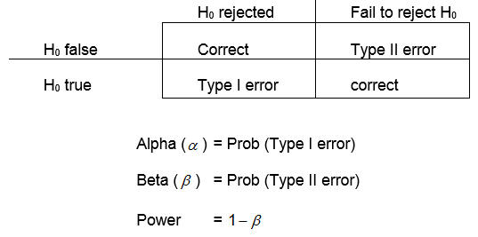
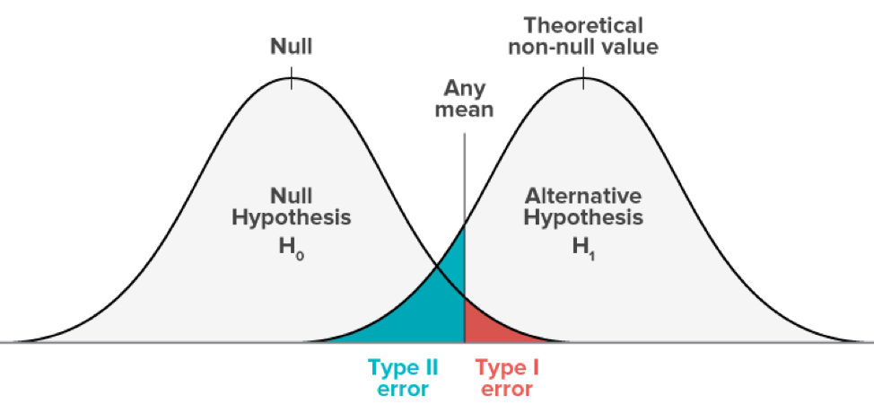

# Statistics Terminology

## Null Hypothesis (H0)

The null hypothesis always assumes there is no effect. The alternative hypothesis assumes an effect. We either _reject the null_ or _fail to reject the null_.

## P-value

Given the [null hypothesis](#null-hypothesis-h0) is true, what's the probability to observe a result as extreme by chance?

::: tip
The higher the p-value, the more evidence against the alternative hypothesis.
The lower the p-vlue, the more evidence to reject the null.
:::

## Type I and Type II Errors

::: tip
Type I errors are false positives. Type II errors are false negatives.
:::

